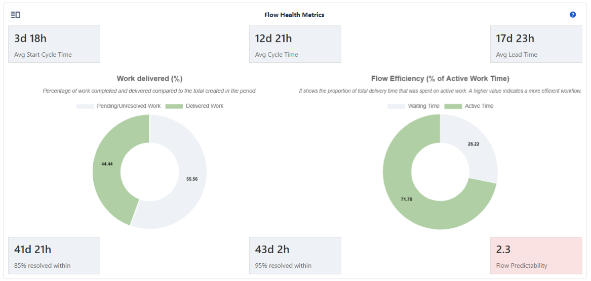
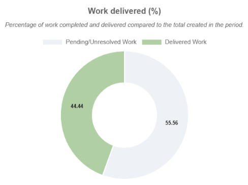
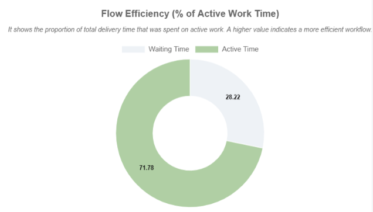
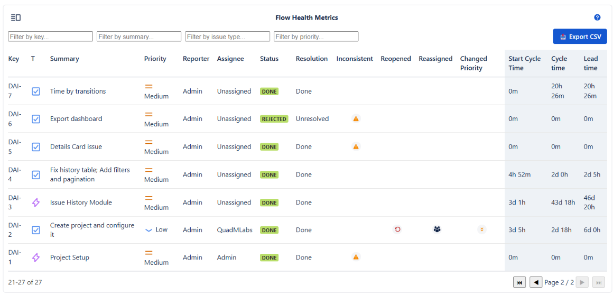

# Flow Health Metrics

:::tip
Overview

This section provides a concise overview of Jira workflow performance using six key metrics (Start Cycle, Cycle, and Lead Time, along with their percentiles and predictability levels), complemented by charts showing the percentage of work delivered and the efficiency of the flow. 

**Together, these elements allow for a quick understanding of the health of the workflow and the stability of the delivery process.**
:::

This section presents six indicators grouped into two categories: **Flow Timing Metrics** and **Flow Predictability Metrics**.  
These metrics provide insight into how efficiently work moves through the system and how predictable delivery performance is.

In addition, there are two charts: **Work delivered (%)** and **Flow Efficiency (% of Active Work Time)**, which indicate the percentage of work delivered and the active time for its delivery.



---

## **1. Flow Timing Metrics**

These three metrics measure how long issues spend in different stages of their lifecycle.

**Avg Start Cycle Time**

Represents the average time an issue stays **waiting to be worked on after** it is created, but before it enters any **In Progress** status category.

>**In Jira context**
>
>    - It measures the time between **Issue Created → First transition into the In Progress status category.**
>    - Long Start Cycle Times usually indicate:
>
>        - Work piling up in the backlog or waiting columns
>        - Slow triage or intake processes
>        - Lack of prioritization or unclear ownership

**Avg Cycle Time**

Represents the average time it takes to complete an issue once work has started.

>**In Jira context**
>
>    - It measures the duration from **First In Progress transition → First transition to the Done status category.**
>    - Long Cycle Times usually reflect:
>
>        - Bottlenecks in development, QA, review, or other workflow stages
>        - Context switching or multitasking
>        - Blocked issues or delayed approvals

**Avg Lead Time**

Represents the total average time from the moment an issue is created until it is completed.

>**In Jira context**
>
>    - It measures Issue Created → Transition to Done category.
>    - Lead Time reflects the full customer wait time, including:
>
>        - Backlog waiting
>        - Active work time
>        - Any delays, handoffs, or rework 

>💡 Lead Time = Start Cycle Time + Cycle Time

---

## 2. Flow Predictability Metrics

These three cards describe delivery predictability and help anticipate completion times.

**P85 (Percentile 85 of Lead Time)**

Indicates that 85% of completed issues finish within this number of days.

>**In Jira context**
>
>    - Calculated from all Lead Times of resolved issues.
>    - Useful when planning for commitments or SLAs.

**P95 (Percentile 95 of Lead Time)**

Indicates that 95% of completed issues finish within this number of days.

>**In Jira context**
>
>    - More conservative than P85.
>    - Useful when planning for high-risk items or ensuring strong service guarantees.

**Flow Predictability**

Measures how predictable delivery is by comparing the P85 to the average Lead Time.

**Formula**
```
Flow Predictability = P85 / Avg Lead Time
```
**Interpretation**

    - Values close to 1.0 indicate high predictability.
    - Higher values mean the team has high delivery variability.

**Flow Predictability Color Interpretation**

:::info
🎨 Flow Predictability is visually highlighted using color to indicate delivery stability.
:::

The following thresholds define how the card color is determined:

    - **Soft Green (≤ 1.2)** → Highly predictable flow, stable delivery times.
    - **Soft Yellow (≤ 1.5)** → Acceptable variability; mostly predictable.
    - **Soft Orange (≤ 2.0)** → Noticeable variability; delivery becoming inconsistent.
    - **Soft Red (> 2.0)** → Unpredictable flow; high variability and instability.
    - **Gray (no data)** → Not enough information to calculate predictability.

This allows users to quickly interpret predictability without reading numerical values.

---

## 3. Interpretation of Flow Health Metrics

:::info
💡 These metrics explain how long work waits, how long it takes to complete once started, and how predictable the overall flow is.
:::

Together, Start Cycle Time, Cycle Time, and Lead Time offer a complete picture of delivery performance:

    - **Start Cycle Time** shows how efficient the team is at picking up work.
    - **Cycle Time** shows how efficient the team is at completing work once started.
    - **Lead Time** shows how long the customer or stakeholder waits.

Meanwhile, P85, P95, and Flow Predictability help answer:

    - *"How consistent is our delivery?"*
    - *"Can we reliably estimate when work will be done?"*
    - *"How much variability exists across issues?"*

High percentiles relative to the average Lead Time indicate high variability and low predictability, while lower percentiles reflect steady and reliable flow.

---

## 4. How to Improve These Metrics

:::tip
⭐ These improvements focus on reducing delays, limiting multitasking, and stabilizing workflow behavior.
:::

**Improvement Recommendations**

    - **Reduce Start Cycle Time**:

        - Improve triage and backlog refinement discipline
        - Prioritize consistently and keep backlog small and clear
        - Assign ownership early and avoid prolonged "To Do" queues

    - **Reduce Cycle Time**:

        - Limit WIP (Work in Progress) to reduce multitasking
        - Identify and remove workflow bottlenecks
        - Use automation to reduce handoff time
        - Resolve blockers quickly and escalate early

    - **Improve Lead Time**:

        - Combine improvements to Start Cycle Time + Cycle Time
        - Streamline intake processes
        - Optimize approval or review steps

    - **Improve Predictability (P85, P95, Flow Predictability)**:

        - Reduce variability by standardizing workflow transitions
        - Avoid unnecessary rework or reopening of issues
        - Keep work items small and consistently sized
        - Use clear Definition of Ready and Definition of Done

> ✔️ Goal: Stable flow, faster delivery, and predictable outcomes.

---

## 5. Work Delivered (%) - Chart

Shows the percentage of cleanly resolved issues (resolved without inconsistencies) relative to all issues analyzed in the selected period.



**Formula**:

```
Work Delivered (%) = (Total Clean Resolved Issues / Total Issues Analyzed) * 100

```

>**In Jira context**
>
>   - "Cleanly resolved" means:
>
>       - Issue is in the Done category
>       - Has a valid Resolution
>       - Passes all consistency checks (no incorrect status category, no invalid resolution timestamps, etc.)
>
>   - "Total issues analyzed" includes all issues in scope for the selected period.

:::info
💡 This chart reflects delivery effectiveness and how much clean value was actually completed.
:::

## 6. Flow Efficiency (% of Active Work Time)

Indicates how much of the total Lead Time was spent in active work versus waiting.



**Formula**

```
Flow Efficiency = (Sum of Cycle Time / Sum of Lead Time) * 100

```
>**In Jira context**
>
>   - **Cycle Time** = Time from first entering *In Progress* → entering *Done*
>   - **Lead Time** = Time from issue creation → entering *Done*
>   - This metric highlights the proportion of time work was actually being executed.

**Interpretation**

    - **High Flow Efficiency (> 40%)** → Work progresses with minimal waiting; strong workflow health.
    - **Moderate Flow Efficiency (20–40%)** → Some waiting or delays present.
    - **Low Flow Efficiency (< 20%)** → Most time is spent waiting; significant bottlenecks exist.

:::info
⭐ This chart makes visible the hidden waste in the system and emphasizes the difference between calendar time and actual work time.
:::

## 7. List View

In addition to cards and charts, this section includes a List view that displays a detailed table of all analyzed issues. 



This table combines standard columns (Key, Summary, Priority, Reporter, Assignee, Status, Resolution) with calculated metrics (Inconsistent, Reopened, Reassigned, Changed Priority, Start Cycle Time, Cycle Time, Lead Time). 

This view can be exported for analysis, audits, or reporting.