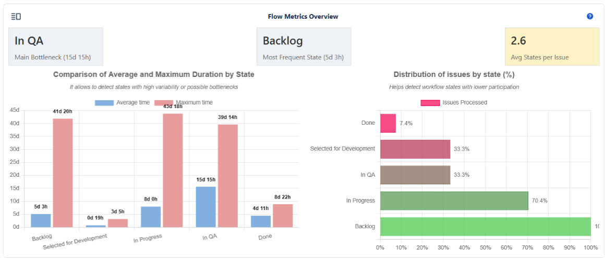
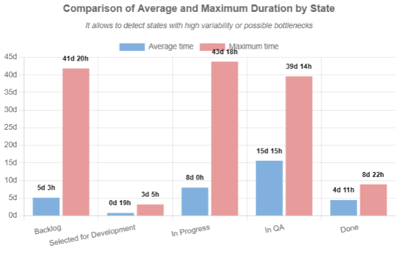
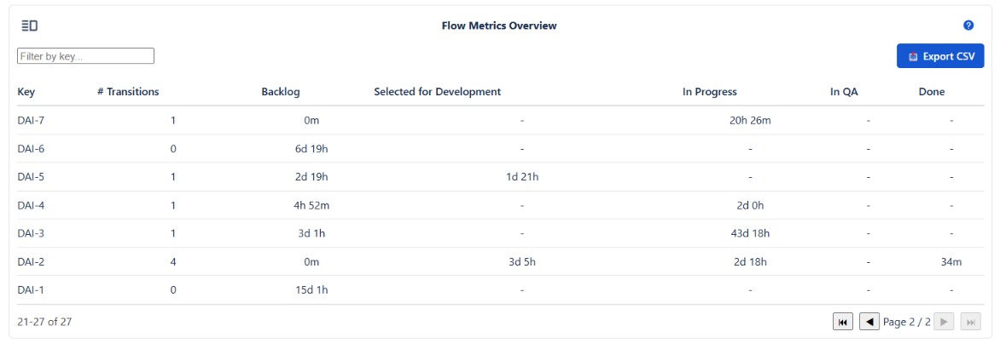

# Flow Metrics Overview

The **Flow Metrics Overview** section provides a complete analysis of how issues move through the workflow during the selected period. Its purpose is to help identify bottlenecks, unused or unnecessary states, state frequency patterns, and overall flow efficiency.
With summary cards, comparative charts, and a detailed list view, this section helps validate the true behavior of the workflow and highlights opportunities for optimization.

📌**What This Section Provides**

This module helps answer key questions such as:

    - Which state is causing the most delay in the workflow?
    - Which states have the highest traffic, and are they expected or problematic?
    - Do issues pass through too many states (over-engineered workflow) or too few (inconsistent flow)?
    - Which workflow states are rarely used?
    - Which issues behave differently from the general pattern?

:::tip
💡 These metrics are especially useful when validating whether the implemented workflow matches how teams actually work day-to-day.
:::

---

## 🔹 Metric Cards
### 1. Main Bottleneck

Displays the state in which issues spent the highest average time.

Includes:

    - State with the longest average duration
    - Average hours spent in that state

:::warning
⚠️ A long duration in a state does not always mean a problem—some states naturally require more time. Compare with expected SLAs or process definitions.
:::

### 2. Most Frequent State

Shows the state visited by the largest number of issues, including:

    - Most frequent state
    - Average hours in that state

:::tip
💡 A highly frequent state may indicate a necessary processing step—or a clustering point that hides inefficiencies.
:::

---

### 3. Avg States per Issue

Displays the average number of states issues passed through.

Color changes based on flow health:

    - 🟢 Green – Expected number of states
    - 🟡 Yellow – Some states may be skipped or used inconsistently
    - 🔴 Red – Issues are bypassing parts of the flow or not following it properly

:::warning
⚠️If this card appears red for multiple periods, it’s a strong indication that the workflow design and team practices are out of sync.
:::

---

## 📊 Charts

### 1. Comparison of Average and Maximum Duration by State

Vertical bar chart showing average and maximum duration per state.

:::tip
💡The gap between average and maximum time helps identify outlier issues that heavily influence the flow.
:::

:::warning
⚠️If the state Done appears with recorded duration, it means issues were reopened. This can indicate rework or quality problems.
:::

---

### 2. Distribution of Issues by State (%)

Horizontal bar chart showing what percentage of issues passed through each state.

:::tip
💡States with very low percentages are candidates for removal or redesign, as teams do not follow those steps in practice.
:::

:::warning
⚠️ Warning: If critical states show extremely low usage, this indicates teams are skipping essential workflow stages.
:::

---

## 📄 Chart View vs List View

### 🔹 Chart View

Displays all summary cards and charts for a high-level understanding.

### 🔹 List View

Displays detailed issue-by-issue activity.

:::tip
💡Use List View to identify unusual issues affecting averages—especially those with many transitions or jumps across the workflow.
:::

--- 

## 🧭 Summary

The Flow Metrics Overview provides a diagnostic view of workflow performance.
By analyzing the cards, charts, and detailed issue transitions, users can:

    - Detect bottlenecks and delays
    - Validate workflow usage
    - Identify unnecessary or unused states
    - Detect abnormal or inconsistent behavior
    - Optimize workflow structure and efficiency

:::tip
💡Review these metrics periodically after workflow changes to confirm improvements or detect new inefficiencies.
:::