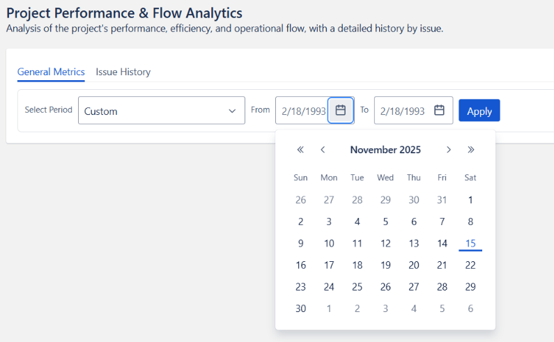

# Getting Started

Welcome to **Project Performance & Flow Analytics** — a powerful Jira add-on that provides advanced metrics, deep performance insights, and analytics that Jira does *not* offer natively.  
This guide will walk you through how to open the app, select an analysis period, interpret errors, and use the Issue History tool.

---

## 🚀 Accessing the App After Installation

Once the app is installed, it becomes available inside each Jira project.

In the **new Jira interface**, you can open it from the project’s top navigation bar:

**Summary | Timeline | Board | Releases | More options**

Go to:

**More options → Project Performance & Flow Analytics**

This will open the app.  
On first load, you will only see the **Period Selector**, which is required before generating analytics.

---

## 📅 Period Selection

The period selector is the first step in generating insights.  
You can choose from several predefined ranges:

- **Last week**  
- **Last month**  
- **Last 3 months**  
- **Last 6 months** (default)  
- **Last year**  
- **Custom range**

---

## 🛠️ Custom Date Range

Selecting **Custom** will display two date pickers:

- **From date**
- **To date**

### Important Limits

:::warning
**Maximum allowed range is 1 year**  
This limitation prevents slowdowns and avoids Jira REST API throttling.
:::
Even if you choose dates from years such as 1999 or 2020, the total span must not exceed **12 months**.

### Best Practice  

:::tip
👉 *Use short or medium ranges for the fastest analytics refresh.*
:::

---

## ▶️ Starting the Analysis

Once a valid period is selected, the app immediately begins:

- Fetching issue activity  
- Aggregating metrics  
- Calculating performance summaries  
- Preparing graphs and tables  

The dashboard loads automatically after processing.

---

## 🔍 Issue History Tool

In the *Issue history* tab, you will find the **Issue key** input.

This section allows you to check the historical activity of a **single issue**, including:

- Status transitions  
- Time spent  
- Workload distribution    

### How to use it:

1. Enter an issue key (e.g., `PROJ-123`)  
2. Press *Search*  
3. View the complete lifecycle of the issue

:::warning
- The issue **must belong to the current project**  
- Issues from other projects **cannot** be retrieved
:::

---

## ⚠️ Errors and Validation Messages

The app provides clear, friendly, and helpful error messages.

### You may see an error if:

- ❌ The selected period returns **no results**
- ❌ The custom range exceeds **1 year**
- ❌ The issue **does not exist**
- ❌ The issue belongs to **another project**

### Example Error Messages

> **No data found for this period**  
> Try selecting a shorter or more recent timeframe.

> **Custom period exceeds 1 year**  
> Reduce the range to a maximum of 12 months.

> **Issue not found in this project**  
> Verify the issue key and ensure it belongs to the current project.

---

## 💡 Helpful Tips

- Shorter analysis ranges load **much faster**  
- Issue History is ideal for **audits, post-mortems, QA reviews, and incident investigations**  
- The app requires **no configuration** — everything works out-of-the-box  
- Metrics are aggregated using **multiple Jira REST APIs** into a single view  
- All analytics are generated **client-side** to avoid exposing project data

---

## 🎉 You're Ready!

With the period selected and the dashboard loaded, you can now explore:

- Productivity metrics  
- Flow efficiency  
- Resolution quality  
- Workload distribution  
- Issue audit trails  

Enjoy your new visibility into project performance!

