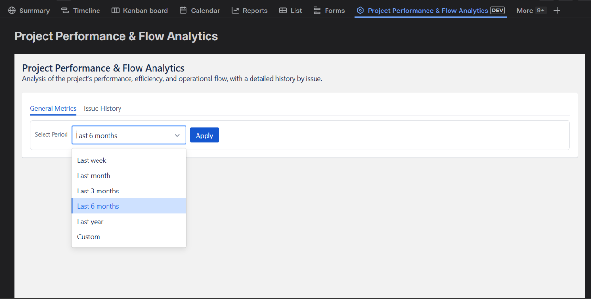
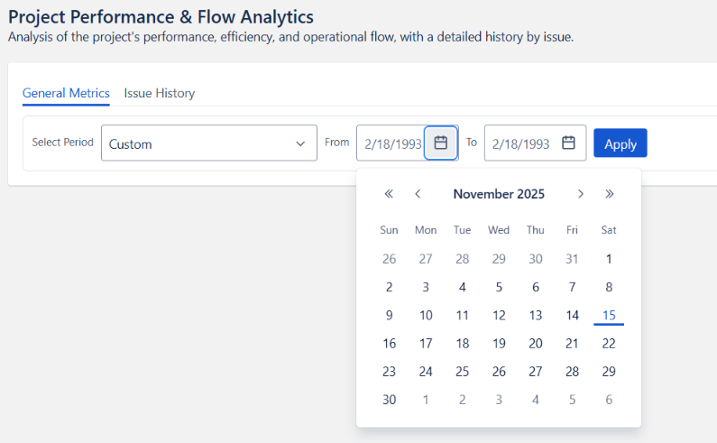
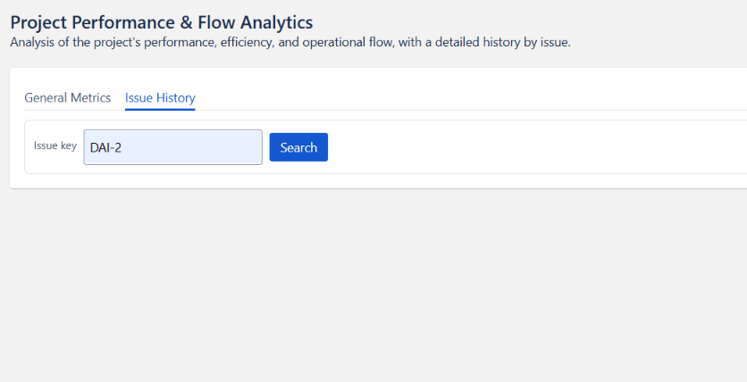

# How It Works

Project Performance & Flow Analytics is designed to provide project-level analytics with minimal configuration.

The analysis starts by selecting a period. The solution then retrieves and processes the relevant Jira issue data before presenting the resulting metrics and visualizations.

## 1. Accessing the Project Dashboard

The solution is implemented as a project-level page within Jira.

Users with access to the project can open the dashboard from the project's navigation menu and begin an analysis without requiring additional configuration.

## 2. Selecting the Analysis Period

The first step is selecting the period to analyze.

Available predefined ranges include:

- Last week
- Last month
- Last 3 months
- Last 6 months
- Last year
- Custom range

### Custom Date Range

A custom analysis can be defined using a start and end date.

The maximum supported range is one year. This limitation was introduced to keep processing times reasonable and reduce the impact of large Jira API requests.

## 3. Processing the Data

Once a valid period is selected, the solution:

1. Retrieves the relevant Jira issue data.
2. Processes issue activity and history.
3. Aggregates the information required by each metric.
4. Calculates performance and flow indicators.
5. Generates the corresponding tables and visualizations.

The resulting analysis is then presented through the project dashboard.

## 4. Issue History Analysis

The Issue History section provides a focused view of the activity of an individual issue.

Users can enter an issue key and review information such as:

- Status transitions
- Time spent
- Changes recorded in the issue history
- Other relevant field changes

The issue must belong to the project being analyzed.

## 5. Validation and Error Handling

The solution validates user input and data availability before processing the analysis.

Examples include:

- Empty analysis periods
- Custom ranges exceeding one year
- Issues that cannot be found
- Issues belonging to another project

These validations help prevent unnecessary processing and provide clearer feedback to the user.

## Technical Considerations

Several implementation decisions were made to balance analytical depth with performance:

- Analysis ranges are limited to a maximum of one year.
- Multiple Jira REST APIs are used to retrieve the required information.
- Data is processed before being presented through the dashboard.
- The solution performs the analysis within the user's project context.

These decisions allow the project to provide detailed analytics while keeping the experience simple for the end user.