import DocCardList from '@theme/DocCardList';
import {useCurrentSidebarCategory} from '@docusaurus/theme-common';

# Project Performance & Flow Analytics

A custom Jira analytics solution developed to provide greater visibility into project performance, issue flow, and process health.

The solution analyzes issue lifecycle and history data and transforms it into practical metrics and visualizations, helping teams identify patterns, bottlenecks, inconsistencies, and areas for improvement.

## Dashboard Preview
|Dashboard - Quick cards|Dashboard - Flow Health Metrics|Dashboard - Flow Metrics Overview|
|---|---|---|
|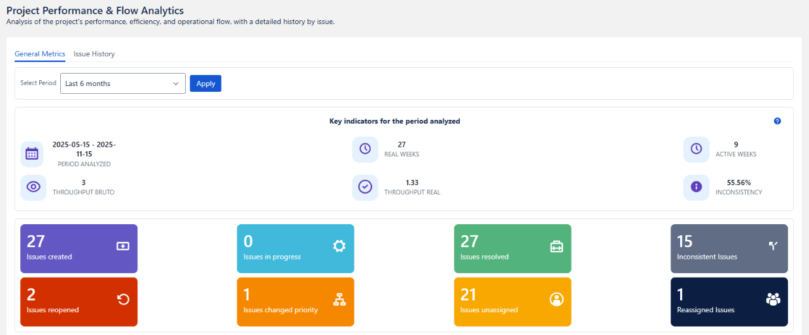|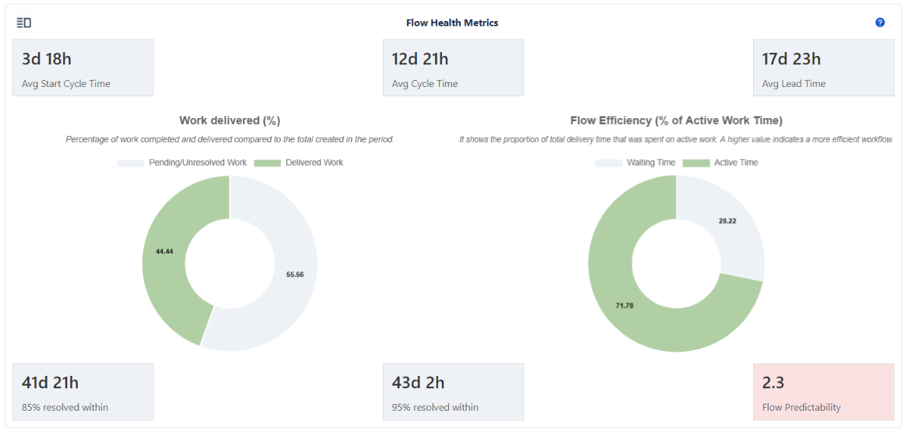|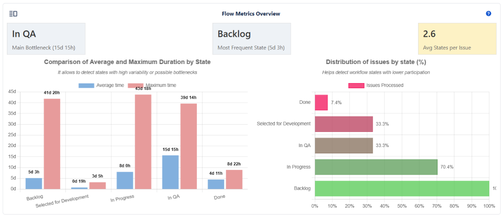|

## Project Information

The project was developed using Atlassian Forge and a React-based Custom UI, integrating Jira Cloud data through REST APIs.

<details>
  <summary>Technical Details</summary>

|Component          | Usage                                |
|-------------------|--------------------------------------|
|Jira Cloud         | Target Platform                      |
|Atlassian Forge    | Application Platform                 |
|React + JavaScript | Frontend development                 |
|Forge Custom UI    | Custom UI implementation             |
|Forge CLI          | Development and deployment           |
|Jira REST API      | Issue and project data               |
|Atlaskit           | Atlassian UI components              |
|CSS                | Custom styling                       |
|Node.js / npm      | Dependencies and development tooling |
|Jira Project Page  | Application entry point              |

</details>

## Overview

Project Performance & Flow Analytics transforms Jira issue and history data into project-level performance and flow metrics.

<details>
  <summary>Project Context</summary>

### The Problem

Jira provides extensive information about issues and their history, but turning that information into meaningful flow and performance metrics can require significant manual analysis.

For example, understanding how long issues spend in individual workflow states may require reviewing their histories, calculating transition durations, and repeating the process across multiple issues.

This project was created to simplify that analysis and make the resulting information easier to understand.

### The Solution

Project Performance & Flow Analytics transforms Jira issue and history data into a set of project-level performance and flow metrics. 

The solution processes the information available in Jira, applies the required calculations, and presents the results through indicators, charts, tables, and issue-level analysis.

Instead of requiring users to manually review issue histories and calculate individual metrics, the dashboard brings these measurements 
together in a single project-level view, making it easier to identify bottlenecks, inconsistencies, delivery patterns, and changes in workflow behavior.
</details>

## How it works

The solution follows a simple workflow: users select an analysis period, Jira data is retrieved and processed, and the resulting metrics and visualizations are generated within the project dashboard.

<details>
  <summary>Technical Workflow</summary>

### Accessing the Project Dashboard

The solution is implemented as a project-level page within Jira.

Users with access to the project can open the dashboard from the project's navigation menu and begin an analysis without requiring additional configuration.

### Selecting the Analysis Period

The first step is selecting the period to analyze.

Available predefined ranges include:

- Last week
- Last month
- Last 3 months
- Last 6 months
- Last year
- Custom range


#### Custom Date Range

A custom analysis can be defined using a start and end date.

The maximum supported range is one year. This limitation was introduced to keep processing times reasonable and reduce the impact of large Jira API requests.


### Processing the Data

Once a valid period is selected, the solution:

1. Retrieves the relevant Jira issue data.
2. Processes issue activity and history.
3. Aggregates the information required by each metric.
4. Calculates performance and flow indicators.
5. Generates the corresponding tables and visualizations.

The resulting analysis is then presented through the project dashboard.

### Validation and Error Handling

The solution validates user input and data availability before processing the analysis.

Examples include:

- Empty analysis periods
- Custom ranges exceeding one year
- Issues that cannot be found
- Issues belonging to another project

These validations help prevent unnecessary processing and provide clearer feedback to the user.

</details>

## Dashboard sections

### Key Indicators for the Period Analyzed

The dashboard provides a set of indicators that summarize project activity and delivery performance for the selected analysis period.

These metrics establish the context for the other analyses in the project by defining the period being evaluated, the project's active time, delivery throughput, and the presence of data inconsistencies.

<!-- SECCION KEY INDICATORS -->
<details>
  <summary>Metric Details</summary>

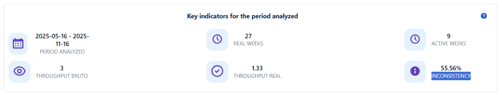

  1. **Period Analyzed**

Defines the start and end dates used for the analysis.

Example:

>```
> 2024-07-01 - 2024-09-30
>```


All metrics presented by the dashboard are calculated within this period.

  2. **Real Weeks**

Represents the total number of weeks included in the selected analysis period.

For example, a three-month analysis period contains approximately twelve weeks

Real Weeks provides the overall time span selected by the user.

  3. **Active Weeks**

Represents the number of weeks during which the project was actually active within the selected period.

For example, if a twelve-week analysis period is selected but the project only became active eight weeks ago:

>```
> Active Weeks = 8
>```

Performance calculations use Active Weeks rather than Real Weeks.

When the selected period fully overlaps the project's active timeline:

>```
> Real Weeks = Active Weeks
>```

This distinction prevents periods in which no project activity occurred from artificially reducing performance metrics.

  4. **Gross Throughput**

Throughput represents the amount of work completed during a given period.

**Gross Throughput** includes all resolved issues, including issues identified as inconsistent.

>```
> Gross Throughput = Total Resolved Issues / Active Weeks
> ```

  5. **Net Throughput**

**Net Throughput** represents the volume of work completed without identified inconsistencies.

>```
> Net Throughput = Correctly Resolved Issues / Active Weeks
> ```

Comparing Gross Throughput with Net Throughput provides additional context about the quality of the reported delivery.

A high gross throughput combined with a significantly lower net throughput may indicate that a considerable portion of completed work contains inconsistencies.

  6. **Inconsistency (%)**

An inconsistent issue is an issue that contains one or more data or process irregularities, such as an incorrect status, invalid resolution, missing information, incorrect categorization, or other conditions identified by the analysis logic.

The **Inconsistency %** represents the proportion of resolved issues that contain these irregularities.

>```
> Inconsistency (%) = (Inconsistent Issues / Total Resolved Issues) * 100
>```

A lower percentage indicates that a greater proportion of completed issues conforms to the criteria used by the analysis.

  - **Interpreting the Indicators**

Gross Throughput and Net Throughput should be considered together with Inconsistency %.

A high Gross Throughput indicates that a significant amount of work was completed during the active period. However, throughput alone does not indicate whether all completed issues were processed consistently.

For example:

  - **High Gross Throughput + Low Inconsistency** indicates strong delivery volume with relatively clean data.
  - **High Gross Throughput + High Inconsistency** indicates high delivery volume but potential process or data-quality concerns.
  - **Low Gross Throughput + Low Inconsistency** indicates lower delivery volume with relatively consistent data.
  - **Low Gross Throughput + High Inconsistency** may indicate both delivery and process-quality concerns.

The distinction between Gross and Net Throughput therefore provides a more complete view of delivery performance than throughput alone.

  - **Addressing High Inconsistency**

A high inconsistency rate may indicate opportunities to improve workflow configuration, governance, or process discipline.

Potential areas for investigation include:

  - **1. Workflow configuration**

    - Ensure closing statuses require appropriate resolutions.
    - Remove invalid or unused resolutions from transitions.
    - Prevent transitions from bypassing required final steps.

  - **2. Resolution Governance**

    - Restrict who can modify the Resolution field.
    - Prevent inappropriate manual changes.
    - Use workflow logic or automation where appropriate to maintain consistency.

  - **3. Validation and Automation**

    - Add validators for required information before closing issues.
    - Use automation to enforce consistent categorization.
    - Identify or flag issues with inconsistent resolutions.

 -  **4. Process Discipline**

    - Establish clear closing practices.
    - Maintain a consistent Definition of Done.
    - Review recurring inconsistencies to identify process patterns.
    
> **The objective is not simply to reduce the inconsistency percentage, but to improve the reliability of the project data and reduce rework.**
</details>

### Quick Cards Metrics

The Quick Cards provide a high-level view of issue activity and operational behavior during the selected analysis period.

Each card represents a specific condition derived from Jira issue data. Together, they provide a quick overview of work entering the project, moving through the workflow, being completed, and being modified during its lifecycle.

<!-- SECCION QUICK CARDS -->
<details>
  <summary>Metric Details</summary>

  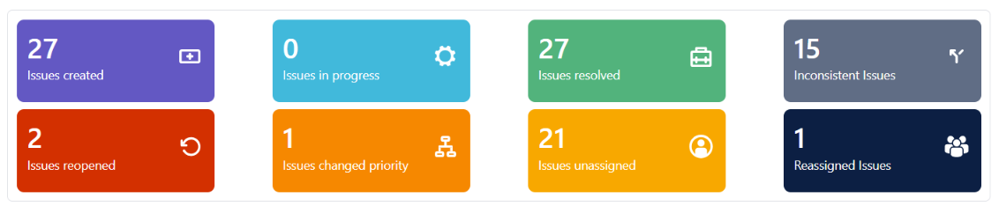

  1. **Issues Created**

Represents all issues created within the selected analysis period.

This provides an indication of the volume of work entering the project.

  2. **Issues In Progress**

Counts issues currently in any status belonging to the **In Progress** status category.

The specific status name does not determine whether an issue is included. Any status mapped to the In Progress category is considered.

Examples may include: QA, Review, In Development, Testing, etc.

  3. **Issues Resolved**

Represents issues that meet both of the following conditions:

- Their current status belongs to the **Done** status category.
- The Resolution field contains a value.

This includes different types of completed outcomes, such as completed, cancelled, or rejected issues.

The metric includes both consistent and inconsistent resolutions.

  4. **Inconsistent Issues**

Identifies issues where the workflow state and resolution data do not represent a consistent lifecycle.

The analysis considers three main conditions.

  - **Resolved but not in Done**

The issue contains a Resolution value, but its final status does not belong to the Done category.

  - **In Done but not resolved**

The issue belongs to the Done status category, but the Resolution field is empty.

  - **Invalid lifecycle data**

The issue belongs to the Done category and has a Resolution, but additional inconsistencies are detected, such as:

    - Resolution date occurring before the creation date.
    - An issue being created and immediately transitioned directly to Done.

These conditions may indicate data-quality, workflow, or automation issues.

  5. **Reopened Issues**

Identifies issues that were previously completed and subsequently returned to an active workflow state.

An issue is considered reopened when:

  - It reached a Done-category status with a valid Resolution.
  - It later moved to a non-Done status.
  - Its Resolution was subsequently cleared.

This metric can help identify work that required additional attention after being considered complete.

  6. **Issues with Priority Change**

Represents issues where the **Priority** field changed at least once during their lifecycle.

Frequent priority changes may indicate changing requirements, shifting business needs, or uncertainty around prioritization.

  7. **Unassigned Issues**

Represents issues that currently have no assignee.

An issue is considered unassigned even if it had an assignee earlier in its lifecycle and was subsequently cleared.

This metric can help identify work that currently lacks a clear owner.

  8. **Reassigned Issues**

Represents issues where responsibility changed from one assignee to another during the issue lifecycle.

A high number of reassigned issues may indicate changes in ownership, workload distribution, or uncertainty about responsibility.

**Interpreting the Quick Metrics**

The Quick Cards provide a compact view of several different aspects of project activity.

Together, these metrics help users understand how work is entering, moving through, and exiting the system.

  - **Work volume**

**Issues Created** and **Issues Resolved** provide an indication of the amount of work entering and leaving the workflow.

A significant increase in created issues may indicate growing demand, while a high number of resolved issues reflects delivery activity.

  - **Workflow activity**

**Issues In Progress** provides an indication of the amount of work currently moving through the workflow.

A consistently high number of in-progress issues may indicate capacity constraints, work accumulation, or bottlenecks.

  - **Process and data quality**

**Inconsistent Issues** and **Reopened Issues** provide additional context around the reliability of the issue lifecycle.

A high number of inconsistencies may indicate workflow or data-governance problems, while frequent reopenings may indicate that work is being closed before the expected outcome is fully achieved.

  - **Ownership and prioritization**

**Unassigned Issues**, **Reassigned Issues**, and **Priority Changes** provide visibility into how work ownership and priorities change during the lifecycle of an issue.

Frequent changes may indicate shifting requirements, workload redistribution, or opportunities to improve the intake and assignment process.

**Using the Metrics for Improvement**

The Quick Cards can also be used as indicators for areas that may require further investigation.

Potential actions include:

- Review workflow configuration when inconsistent lifecycle states are detected.
- Require valid Resolution values when issues transition into Done statuses.
- Restrict inappropriate modifications to Resolution and Priority fields.
- Improve assignment practices to ensure issues have clear ownership.
- Review frequent priority changes to identify unclear or changing requirements.
- Analyze reopened issues to understand why completed work returned to the workflow.
- Investigate recurring inconsistencies to identify automation or configuration problems.
- Review automatic transitions that may create premature or unexpected status changes.
- Establish clear workflow and Definition of Done practices.

The objective is not simply to reduce the numbers shown by these cards, but to use them as signals for understanding **how work moves through the project and where the underlying process may need attention**.
</details>

### Flow Health Metrics

Flow Health provides a view of how work moves through the project, how long it takes to complete, and how consistent the delivery process is.

The analysis combines timing metrics, delivery percentiles, predictability, and flow efficiency to provide a broader view of workflow behavior.

<!-- SECCION FLOW HEALTH METRICS -->
<details>
  <summary>Metric Details</summary>

  

  1. **Flow Timing Metrics**

These metrics describe the time an issue spends waiting, being worked on, and progressing through the complete lifecycle.

**Average Start Cycle Time**

Average time between issue creation and the first transition into the **In Progress** status category.

>```
> Start Cycle Time = Issue Created → First In Progress transition
>```

A high Start Cycle Time may indicate delays in:
    - Triage or intake
    - Prioritization
    - Assignment
    - Backlog management
    - Starting work on new issues

**Average Cycle Time**

Average time required to complete an issue after work has started.

>```
> Cycle Time = First In Progress transition → First Done transition
>```

A high Cycle Time may indicate:
    - Workflow bottlenecks
    - Blocked work
    - Delayed reviews or approvals
    - Excessive context switching
    - Rework

**Average Lead Time**

Average total time from issue creation until completion.

>```
> Lead Time = Issue Created → First Done transition
>```

Lead Time represents the complete elapsed time experienced by the requester or stakeholder, including waiting time and active work.

Conceptually:

>```
> Lead Time ≈ Start Cycle Time + Cycle Time
>```

The relationship provides a useful distinction between time spent waiting to start work and time spent actively progressing through the workflow.

  2. **Lead Time Percentiles**

Percentiles provide additional context about the distribution of Lead Time values.

**P85 Lead Time**

The P85 value represents the Lead Time within which approximately 85% of completed issues were delivered.

It provides a more representative planning threshold than the average when delivery times contain significant variation.

**P95 Lead Time**

The P95 value represents the Lead Time within which approximately 95% of completed issues were delivered.

Because it considers the upper portion of the distribution, P95 provides a more conservative view of delivery time and is useful when evaluating longer-running work.

Comparing the average Lead Time with P85 and P95 helps identify how much variation exists across completed issues.

**Flow Predictability**

Flow Predictability is a derived metric that compares P85 Lead Time with the average Lead Time.

>```
> Flow Predictability = P85 Lead Time / Average Lead Time
>```

Values closer to 1.0 indicate that the P85 is relatively close to the average, suggesting lower variation in delivery times.

Higher values indicate that the upper portion of the Lead Time distribution is significantly larger than the average, suggesting greater variability.

**Predictability Thresholds**

The dashboard uses the following thresholds to provide a visual indication of delivery variability:

| Value   | Interpretation           |
|---------|--------------------------|
| ≤ 1.2   | Highly predictable flow  |
| ≤ 1.5   | Mostly predictable       |
| ≤ 2.0   | Noticeable variability   |
| > 2.0   | High variability         |
| No data | Insufficient information |

The color associated with the value provides a quick visual indication, while the numerical value provides the underlying measurement.

  3. **Interpreting Flow Health**

The timing metrics provide different perspectives on the same workflow.

    - **Start Cycle Time** indicates how long work waits before being started.
    - **Cycle Time** indicates how long work takes once it has started.
    - **Lead Time** represents the complete elapsed time from creation to completion.

This distinction helps identify where delays are occurring.

For example, a high Start Cycle Time with a relatively low Cycle Time may indicate that the team can complete work efficiently once it starts, but work is spending too much time waiting to be picked up.

Conversely, a low Start Cycle Time combined with a high Cycle Time may indicate that work starts quickly but encounters delays during execution.

P85, P95, and Flow Predictability provide another dimension by showing how consistent those delivery times are across issues.

  4. **Work Delivered**

The Work Delivered (%) chart represents the proportion of analyzed issues that were resolved cleanly.

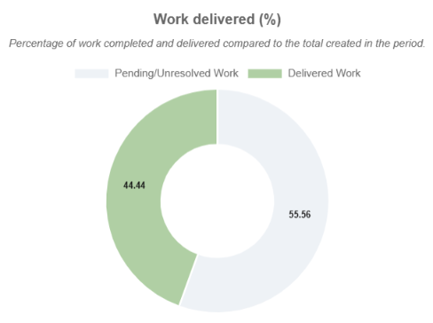

>```
> Work Delivered (%) = Clean Resolved Issues / Total Issues Analyzed × 100
>```

A cleanly resolved issue is one that:

    - Reaches the Done status category.
    - Contains a valid Resolution.
    - Passes the consistency checks defined by the analysis.

The metric provides a view of delivery effectiveness by distinguishing completed work from completed work that contains identified inconsistencies.

  5. **Flow Efficiency** 

Flow Efficiency represents the proportion of Lead Time spent in active work rather than waiting.

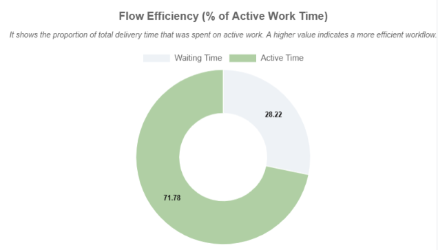

>```
> Flow Efficiency = Sum of Cycle Time / Sum of Lead Time × 100
>```

Where:

    - **Cycle Time** represents the time from the first In Progress transition to the first Done transition.
    - **Lead Time** represents the time from issue creation to the first Done transition.

The metric therefore highlights the relationship between active execution time and total elapsed time.

**Interpretation**

| Flow Efficiency | General interpretation                |
|-----------------|---------------------------------------|
| > 40%           | Higher proportion of active work time |
| 20–40%          | Moderate waiting time                 |
| < 20%           | Significant waiting time              |

These thresholds are intended as practical indicators rather than universal benchmarks. The appropriate level of efficiency depends on the type of work and the workflow being analyzed.

  6. **Issue-Level Analysis**

The Flow Health section also provides a detailed list of the issues included in the analysis.

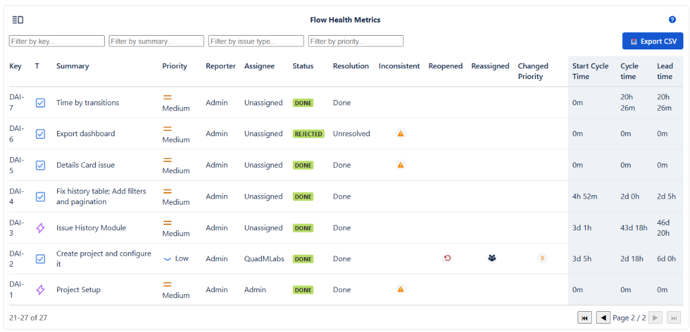

The table combines standard Jira issue information with calculated flow metrics.

**Standard information**

    - Key
    - Summary
    - Priority
    - Reporter
    - Assignee
    - Status
    - Resolution
    
**Calculated information**

    - Inconsistent
    - Reopened
    - Reassigned
    - Changed Priority
    - Start Cycle Time
    - Cycle Time
    - Lead Time

The detailed view allows the aggregate metrics displayed in the dashboard to be traced back to individual issues.

The data can also be exported for further analysis, audits, or reporting.

**Using the Metrics for Process Improvement**

The metrics can help identify different types of workflow problems.

  - **High Start Cycle Time**

Potential areas to investigate:

    - Intake and triage processes
    - Backlog prioritization
    - Assignment practices
    - Work queues

  - **High Cycle Time**

Potential areas to investigate:

    - Workflow bottlenecks
    - Work in progress
    - Approval or review stages
    - Blocked issues
    - Rework

  - **High Lead Time with Low Cycle Time**

This may indicate that issues spend a significant amount of time waiting before work begins.

  - **High Lead Time and High Cycle Time**

This may indicate delays both before and during active work.

  - **High Predictability Ratio**

A high Flow Predictability value indicates greater variation in delivery times and may warrant investigation into unusually long-running issues, workflow variability, or inconsistent work patterns.

  - **Low Flow Efficiency**

A low Flow Efficiency value indicates that a large proportion of total Lead Time is spent outside active work. This can help identify waiting, handoffs, queues, or other sources of delay.

The purpose of these metrics is therefore not only to measure performance, but to provide signals that can guide further analysis of the underlying process.
</details>

### Flow Metrics Overview

The **Flow Metrics Overview** section analyzes how issues move through the workflow during the selected period.

It combines summary metrics, comparative charts, and issue-level data to identify bottlenecks, frequently used states, rarely used states, and unusual workflow behavior.

The objective is to compare the **workflow as configured in Jira** with the way work actually moves through it.

<!-- SECCION FLOW METRICS OVERVIEW -->
<details>
  <summary>Metric Details</summary>

  

**What This Section Helps Identify**

The analysis can help answer questions such as:

- Which workflow state causes the most delay?
- Which states are visited most frequently?
- Are some workflow states rarely or never used?
- Are issues passing through more states than expected?
- Are issues bypassing important stages?
- Which individual issues behave differently from the general workflow pattern?

These indicators are particularly useful when reviewing whether the configured workflow accurately represents the team's real operating process.

**Metric Cards**

  1. **Main Bottleneck**

Identifies the workflow state with the highest average duration.

The metric displays:

- The state with the longest average duration
- The average time spent in that state

A long duration does not necessarily indicate a problem. Some states naturally require more time depending on the type of work.

The metric becomes more useful when compared with expected processing times, SLAs, or the team's defined process.

  2. **Most Frequent State**

Identifies the workflow state visited by the largest number of issues.

The metric displays:

- The most frequently visited state
- The average time spent in that state

A highly frequent state may represent an essential processing step, but it may also reveal a point where work accumulates or where issues repeatedly converge.

Frequency should therefore be considered together with duration.

  3. **Average States per Issue**

Measures the average number of workflow states visited by issues during their lifecycle.

This provides an indication of how complex or consistent the observed workflow path is.

The metric uses visual thresholds to highlight potential differences between the configured workflow and actual issue behavior:

- **Green** — expected flow behavior
- **Yellow** — potential inconsistencies or variations
- **Red** — significant deviation from the expected workflow

A consistently high or low value across multiple analysis periods may indicate that the workflow design and actual team practices are not fully aligned.

**Charts**

  1. **Average vs. Maximum Duration by State**

This chart compares the average and maximum time spent in each workflow state.

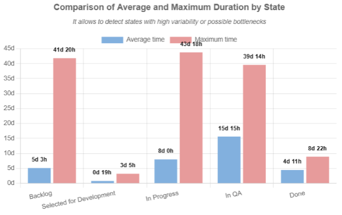

The difference between the average and maximum values can reveal outlier issues that significantly affect the overall workflow.

For example, a state with a relatively low average duration but a very high maximum may indicate that most issues move through the state normally while a small number of issues become significantly delayed.

  - **Reopened Issues**

If the **Done** state has recorded duration, this indicates that at least some issues subsequently left the Done category and re-entered the workflow.

This can be an indicator of:

- Rework
- Incorrect closure
- Quality issues
- Issues being reopened after completion

The metric therefore provides additional context when interpreting the duration of the Done state.

  2. **Distribution of Issues by State**

This horizontal bar chart shows the percentage of analyzed issues that passed through each workflow state.

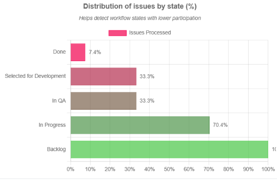

The distribution provides insight into how frequently each state is actually used.

States with very low usage may indicate:

- Optional workflow paths
- Rare business scenarios
- States that are no longer needed
- Steps that teams routinely bypass

Low usage does not automatically mean that a state should be removed. Critical states with unexpectedly low usage, however, may indicate that the configured process is not being followed consistently.

**Chart View and List View**

  - **Chart View**

The Chart View provides the aggregated analysis through summary cards and visualizations.

It is intended for quickly identifying patterns, bottlenecks, and unusual workflow behavior.

  - **List View**

The List View provides issue-level information behind the aggregated metrics.

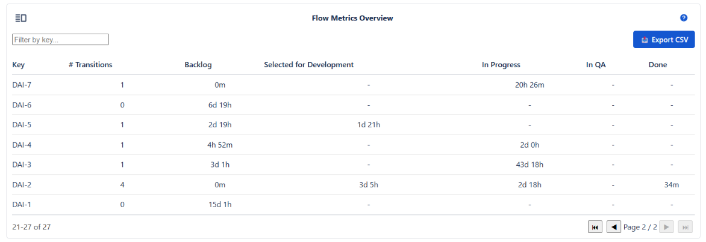

It can be used to investigate individual issues and identify the specific records contributing to unusual averages or workflow patterns.

For example, it can help identify issues that:

- Passed through an unusually large number of states
- Skipped expected workflow stages
- Spent significantly longer than average in a particular state
- Followed an unusual transition path

This makes the List View useful when moving from **aggregate analysis to root-cause investigation**.

**Interpreting the Results**

The Flow Metrics Overview should be interpreted as a diagnostic tool rather than as an automatic recommendation to change the workflow.

A state with high duration may be legitimate. A state with low usage may be required for exceptional cases. Similarly, a high number of workflow states does not necessarily mean that the workflow is poorly designed.

The value of the analysis comes from comparing the observed behavior with:

- Expected business processes
- Workflow design
- SLAs or target processing times
- Team practices
- Historical results

This allows teams to distinguish between **intentional workflow behavior** and patterns that may indicate opportunities for improvement.

**Summary**

The Flow Metrics Overview provides a diagnostic view of how the Jira workflow behaves in practice.

By combining aggregate metrics with issue-level information, it helps users:

- Identify bottlenecks and delays
- Understand which states are actually being used
- Detect rarely used or bypassed workflow stages
- Investigate unusual issue paths
- Identify potential rework and reopening patterns
- Compare configured workflows with real operational behavior

Reviewing these metrics periodically can also help evaluate whether workflow changes are producing the intended improvements.
</details>

### Issue History

The **Issue History** section provides a focused view of how an individual Jira issue evolved throughout its lifecycle.

Users can search for an issue by key and review both its issue-specific flow metrics and its complete change history.

<!-- SECCION ISSUE HISTORY -->
<details>
  <summary>Explore Issue History</summary>

  

**Searching for an Issue**

The tool uses the issue key to retrieve the historical activity of an issue.

For example:

>```
> PROJ-123
>```

The search is restricted to the current project, since the application operates at project level.

Only searches by issue key are supported. Searching by summary, reporter, description, or other issue attributes is not available.

**Issue-Specific Flow Metrics**

Once the issue is found and analyzed, two main outputs are displayed:

---

  1. **Flow Health Metrics Summary (Issue-Specific)**

Once an issue is found, the application provides a compact view of its flow behavior.

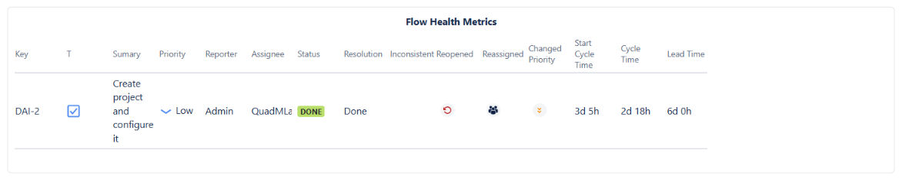

The issue-level analysis includes information such as:

    - Time spent across workflow states
    - Number of transitions
    - State re-entries
    - Flow irregularities

These metrics provide context about how the individual issue moved through the workflow.

  2. **Complete Issue History**

The history view displays the recorded changes for the selected issue in chronological order.

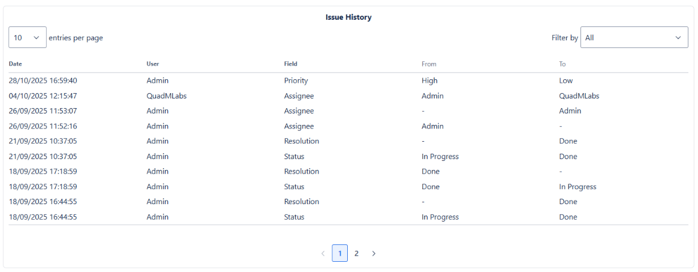

The table includes:

|Column | Description                   |
|------ |-------------------------------| 
|Date   | When the change occurred      |
|User   | User who performed the change |
|Field  | Field that was modified       |
|From   | Previous value                |
|To	    | New value                     |

This provides a detailed view of how the issue changed over time and makes it easier to investigate specific events.

**Field-Based Filtering**

The history table can be filtered by the field that was changed.

The filter is generated dynamically from the issue's actual history. Only fields that have recorded changes are included.

For example:

    - If **Assignee** was changed, it appears as a filter option.
    - If **Priority** was never changed, it does not appear as a filter option.
    - If **Description** has no recorded changes, it is not included in the filter list.

This approach keeps the filter focused on information that is actually relevant to the selected issue.

**Why This Matters**

Long Jira histories can contain a large number of unrelated events. When investigating a specific problem, such as an unexpected reassignment or priority change, manually reviewing the entire history can introduce unnecessary noise.

Filtering the history by field allows users to focus directly on the changes relevant to their investigation.

For example, a support or troubleshooting investigation can quickly isolate:

    - Status changes
    - Assignee changes
    - Priority changes
    - Resolution changes
    - Other fields with recorded historical activity

The absence of a field from the filter does not mean that the field does not exist on the issue. It only means that no changes to that field were recorded in the issue history.

**Typical Use Cases**

Issue History can be useful for:

    - Troubleshooting unexpected issue behavior
    - Investigating workflow transitions
    - Reviewing reassignment or priority changes
    - Supporting incident investigations
    - Validating workflow behavior
    - Performing issue-level audits
    - Understanding the lifecycle of individual issues

**Summary**

Issue History combines four capabilities in a single view:

    - Focused issue lookup by key
    - Issue-specific flow metrics
    - Chronological change history
    - Dynamic filtering based on recorded changes

Together, these features make it easier to move from **"something happened to this issue"** to **"exactly what happened, when, and who changed it."**
</details>

<!-- <DocCardList items={useCurrentSidebarCategory().items} /> -->

